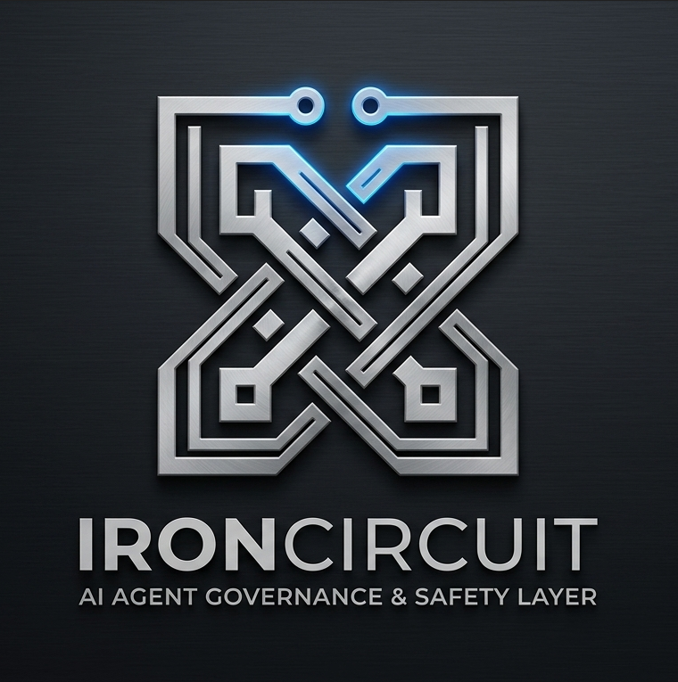

# IronCircuit 🛡️



**The High-Performance C++ Circuit Breaker for LLM Token Governance.**

IronCircuit is a framework-agnostic safety layer designed to prevent runaway costs and unauthorized usage in autonomous AI agent systems. By leveraging a high-speed C++ core, it provides real-time token monitoring and enforcement with negligible latency, acting as a "Circuit Breaker" that halts agent activity before limits are exceeded.

### Why IronCircuit?

Autonomous agents can quickly consume vast amounts of tokens if caught in a loop or misconfigured. IronCircuit provides the infrastructure to stop this:

* **High-Performance C++ Core:** The `ironcircuit` engine is built in C++ and exposed via `pybind11`, ensuring that token monitoring happens in microseconds, not milliseconds.
* **Fail-Closed Governance:** If the system detects that a pre-defined token limit is reached, it immediately stops the agent, ensuring your budget is protected.
* **Persistent State:** Unlike ephemeral memory monitors, IronCircuit persists usage data to disk, maintaining accurate counts even through application restarts or crashes.
* **Thread-Safe Enforcement:** Built with concurrency in mind, it safely handles multi-threaded agent environments, preventing race conditions in your audit trail.
* **Framework Agnostic:** Whether you use LangChain, CrewAI, or custom loops, IronCircuit integrates seamlessly via a simple decorator pattern.

### Repository Layout

```text
iron-circuit/
  assets/                 Branding and logo
  src/                    C++ core engine
  ironcircuit_manager.py  Python wrapper & safety layer
  build.ps1               Build automation
  pyproject.toml          Build system configuration
  requirements.txt        Dependency manifest

Quick Start

    Build the Engine:

PowerShell

.\build.ps1

    Protect your logic:

Python

from ironcircuit_manager import IronCircuitManager

# Initialize the monitor
manager = IronCircuitManager()

# Wrap your expensive LLM calls
@manager.protect(token_cost=50.0)
def run_agent_task():
    # This logic will only run if you have enough tokens remaining
    ...

For questions, feature requests, or bug reports, please open a GitHub Issue.

For private inquiries, you can reach the maintainer at jielabs.dev@gmail.com.

Built with passion at JieLabs.
